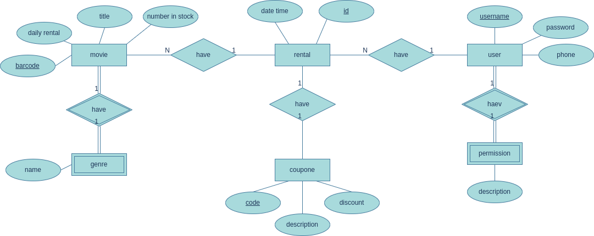

# Vidly API  

A RESTful API for managing movies, customers, genres, and rentals with JWT authentication and role-based access control.

## Table of Contents  
- [Vidly API](#vidly-api)
  - [Table of Contents](#table-of-contents)
  - [Features](#features)
  - [Authentication](#authentication)
  - [API Endpoints](#api-endpoints)
    - [Genres](#genres)
    - [Customers](#customers)
    - [Movies](#movies)
    - [Rentals](#rentals)
    - [Authentication \& Users](#authentication--users)
  - [SQL Database Implementation](#sql-database-implementation)

---

## Features  
- **CRUD Operations** for genres, customers, movies, and rentals  
- **JWT Authentication** with role-based access control  
- **Admin Panel** for user management  
- **Validation** for all requests  

---

## Authentication  
Include the JWT token in the `x-auth-token` header for protected routes:  
```http
Authorization: Bearer <your_token>
```

---

## API Endpoints  

### Genres  
| Method | Endpoint           | Description                          | Auth Required |
|--------|--------------------|--------------------------------------|---------------|
| GET    | `/api/genres`      | Get all genres                       | No            |
| GET    | `/api/genres/:id`  | Get a genre by ID                    | No            |
| POST   | `/api/genres`      | Create a new genre                   | Yes           |
| DELETE | `/api/genres/:id`  | Delete a genre by ID                 | Yes           |

**Example Request (POST):**  
```json
{
  "name": "Action"
}
```

---

### Customers  
| Method | Endpoint               | Description                          | Auth Required |
|--------|------------------------|--------------------------------------|---------------|
| GET    | `/api/customers`       | Get all customers                    | No            |
| GET    | `/api/customers/:id`   | Get a customer by ID                 | No            |
| POST   | `/api/customers`       | Create a new customer                | Yes           |
| PUT    | `/api/customers/:id`   | Update a customer by ID              | Yes           |
| DELETE | `/api/customers/:id`   | Delete a customer by ID              | Yes           |

**Example Request (POST):**  
```json
{
  "name": "John Doe",
  "phone": "1234567890"
}
```

---

### Movies  
| Method | Endpoint            | Description                          | Auth Required |
|--------|---------------------|--------------------------------------|---------------|
| GET    | `/api/movies`       | Get all movies                       | No            |
| GET    | `/api/movies/:id`   | Get a movie by ID                    | No            |
| POST   | `/api/movies`       | Create a new movie                   | Yes           |
| PUT    | `/api/movies/:id`   | Update a movie by ID                 | Yes           |
| DELETE | `/api/movies/:id`   | Delete a movie by ID                 | Yes           |

**Example Request (POST):**  
```json
{
  "title": "Inception",
  "genreId": "671fc4488a87f71534bd30a1",
  "numberInStock": 10,
  "dailyRentalRate": 2.5
}
```

---

### Rentals  
| Method | Endpoint            | Description                          | Auth Required |
|--------|---------------------|--------------------------------------|---------------|
| GET    | `/api/rentals`      | Get all rentals                      | Yes           |
| POST   | `/api/rentals`      | Create a new rental                  | Yes           |

**Example Request (POST):**  
```json
{
  "customerId": "671fc8ecb1382d0ad4e66357",
  "movieId": "671fca90f5c0f20e08125bbc"
}
```

---

### Authentication & Users  
| Method | Endpoint            | Description                          | Auth Required |
|--------|---------------------|--------------------------------------|---------------|
| POST   | `/api/users`        | Register a new user                  | No            |
| POST   | `/api/auth`         | Login (returns JWT token)            | No            |
| GET    | `/api/users/me`     | Get current user details             | Yes           |

**Example Registration (POST `/api/users`):**  
```json
{
  "name": "Jane Doe",
  "email": "jane@example.com",
  "password": "securePassword123"
}
```

---

## SQL Database Implementation  
For relational database setups, refer to the Entity-Relationship Diagram (EER) below:  

  

**Note**:  
- The SQL implementation differs slightly from the NoSQL version but retains core functionality.  
- Tables map to the current models (`users`, `movies`, `genres`, etc.).  
